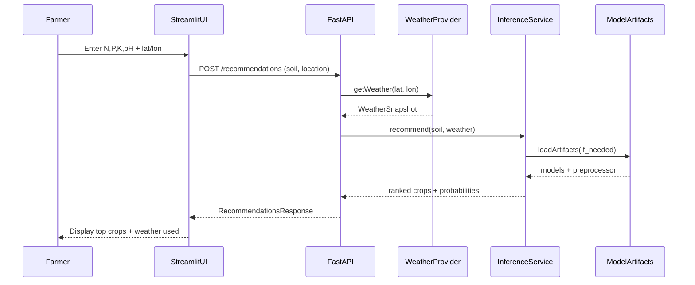

# Sequence: crop recommendation request (v1)

```mermaid
sequenceDiagram
  participant Farmer as Farmer
  participant UI as StreamlitUI
  participant API as FastAPI
  participant Weather as WeatherProvider
  participant Infer as InferenceService
  participant Art as ModelArtifacts

  Farmer->>UI: Enter N,P,K,pH + lat/lon
  UI->>API: POST /recommendations (soil, location)
  API->>Weather: getWeather(lat, lon)
  Weather-->>API: WeatherSnapshot
  API->>Infer: recommend(soil, weather)
  Infer->>Art: loadArtifacts(if_needed)
  Art-->>Infer: models + preprocessor
  Infer-->>API: ranked crops + probabilities
  API-->>UI: RecommendationsResponse
  UI-->>Farmer: Display top crops + weather used
```

